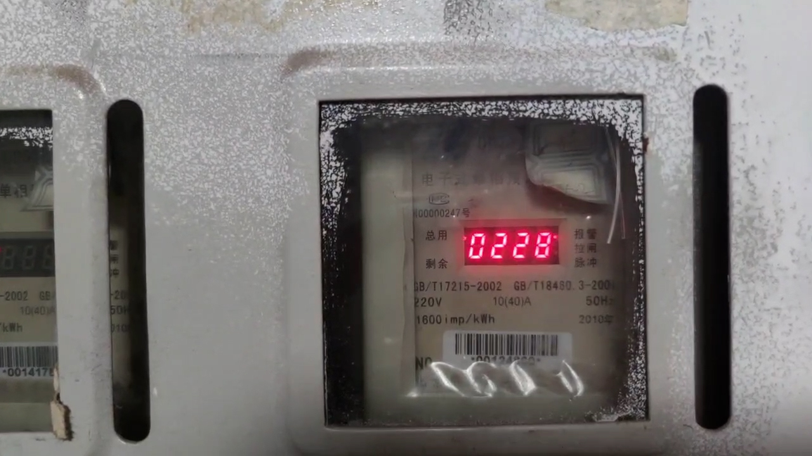
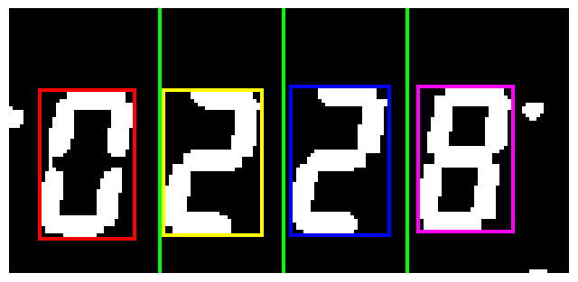

# MeterVision - 电表视觉识别系统


## 项目简介
基于 OpenCV 的电表数字识别系统，从电表图像或视频中自动提取并识别数字信息。

## 主要功能
- 电表图像预处理与增强
- 电表区域自动检测与定位
- 七段码数字识别
- 批量处理多张电表图像
- 支持视频流中的电表读数识别

## 技术栈
- Python
- OpenCV
- NumPy
- Matplotlib
- Jupyter Notebook

## 快速开始
### 环境配置
```bash
# 克隆仓库
git clone https://github.com/Shiqi-SQ/DigitalMeterReader.git
cd MeterVision

# 安装依赖
pip install opencv-python numpy matplotlib
```

### 使用方法
1. 运行Jupyter Notebook:
```bash
jupyter notebook
```
2. 打开 `CVDemo.ipynb` 文件，按照步骤执行代码单元

## 七段码识别原理
本项目使用七段码识别技术来识别电表上的数字。七段码是一种常见的数字显示方式，由7个线段组成，通过不同组合显示0-9的数字。项目中的 `七段码打表.txt` 文件包含了所有可能的七段码组合及其对应的数字映射。

## 识别流程
1. 图像预处理：去噪、增强对比度
2. 颜色空间转换：RGB转HSV，提取特定颜色区域
3. 轮廓检测：定位电表区域
4. 透视变换：校正电表视角
5. 数字分割：分离各个数字位
6. 七段码识别：识别每个数字位的值
7. 结果输出：整合识别结果
